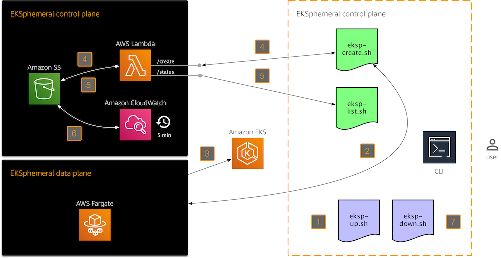

# EKSphemeral: The EKS Ephemeral Cluster Manager

> Do not use in production. This is a service for development and test environments. 

A simple Amazon EKS manager for ephemeral dev/test clusters, allowing you to launch an EKS cluster with an automatic tear-down after a given time.

EKSphemeral uses, in a nutshell, a AWS Lambda/Amazon S3 combo (as the control plane) and AWS Fargate (as the data plane):



1. The `eksp-up.sh` script provisions EKSphemeral's control plane (Lambda+S3). This is a one-time action, think of it as installing EKSphemeral in your AWS environment.
1. Whenever you want to provision a throwaway EKS cluster, use `eksp-create.sh`. It will do two things: 
1. Provision the cluster using [eksctl](https://eksctl.io) running in Fargate (what we call the EKSphemeral data plane), and when that is completed,
1. Create an cluster spec entry in S3, via the `/create` endpoint of EKSphemeral's HTTP API.
1. Once that is done, you can use `eksp-list.sh` to list all managed clusters or, should you wish to gather more information on a specific cluster, use `eksp-list.sh $CLUSTERID` to retrieve it. This script uses the `/status` endpoint of EKSphemeral's HTTP API.
1. Every 5 minutes, there is a CloudWatch event that triggers the execution of another Lambda function called `DestroyClusterFunc`, which notifies the owners of clusters that are about to expire (send an email up to 5 minutes before the cluster is destroyed), and when the time comes, it tears the cluster down. 
1. Last but not least, if you want to get rid of EKSphemeral, use the `eksp-down.sh` script, removing all cluster specs in the S3 bucket and deleting all three Lambda functions.

If you like, you can have a look at a [4 min video walkthrough](https://www.youtube.com/watch?v=2A8olhYL9iI), before you try it out yourself. Since the minimal time for an end-to-end provisioning and usage cycle is ca. 40min, the video walkthrough is showing a 1:10 time compression, roughly.

If you want to try it out yourself, follow the steps below.

## Preparation

In order to use EKSphemeral, clone this repo, and make sure you've got `jq`, the `aws` CLI and the [Fargate CLI](https://somanymachines.com/fargate/) installed.


Make sure to set the respective environment variables before you proceed. This is so that the install process knows which S3 bucket to use for the control plane's Lambda functions (`EKSPHEMERAL_SVC_BUCKET`) and where to put the cluster metadata (`EKSPHEMERAL_CLUSTERMETA_BUCKET`):

```sh
$ export EKSPHEMERAL_SVC_BUCKET=eks-svc
$ export EKSPHEMERAL_CLUSTERMETA_BUCKET=eks-cluster-meta
```

Create the S3 bucket for the Lambda functions like so:

```sh
$ aws s3api create-bucket \
      --bucket $EKSPHEMERAL_SVC_BUCKET \
      --create-bucket-configuration LocationConstraint=us-east-2 \
      --region us-east-2
```

Create the S3 bucket for the cluster metadata like so:

```sh
$ aws s3api create-bucket \
      --bucket $EKSPHEMERAL_CLUSTERMETA_BUCKET \
      --create-bucket-configuration LocationConstraint=us-east-2 \
      --region us-east-2
```

Now that we have the S3 buckets set up, let's move on to the service code.

## Usage

The following assumes that the S3 buckets as outlined above have been set up and you have access to AWS configured, locally.

```sh
$ ./eksp-up.sh
```

First, let's check what clusters are already managed by EKSphemeral:

```sh
$ ./eksp-list.sh
["9be65bee-3baa-4fd0-aa3e-032325d5390c","dd72f73a-3457-4d4b-b997-08a2b376160b"]
```

Here, we get an array of cluster IDs back. We can use such an ID as follows to look up the spec of a particular cluster:

```sh
$ ./eksp-list.sh dd72f73a-3457-4d4b-b997-08a2b376160b | jq
{
  "name": "default-eksp",
  "numworkers": 1,
  "kubeversion": "1.12",
  "timeout": 20,
  "owner": "nobody@example.com"
}
```

Now, let's create a throwaway cluster named `2node-111-30`, using the `EKSPHEMERAL_SG` security group, with two worker nodes, using Kubernetes version 1.11, with a 30 min timeout as defined in the example cluster spec file [2node-111-30.json](svc/2node-111-30.json):

```sh
$ cat svc/2node-111-30.json
{
    "name": "2node-111-30",
    "numworkers": 2,
    "kubeversion": "1.11",
    "timeout": 30,
    "owner": "hausenbl+notif@amazon.com"
}

$ ./eksp-create.sh 2node-111-30.json $EKSPHEMERAL_SG
```

Note that both the security group and the cluster spec file are optional. If not present, the first security group of the default VPC and `default-cc.json` will be used.

## Tear down

To tear down EKSphemeral, use the following command which will remove control plane elements (Lambda functions, S3 bucket content):

```bash
$ ./eksp-down.sh
```

## Development

See the dedicated [development docs](dev.md) for how to customize and extend EKSphemeral.