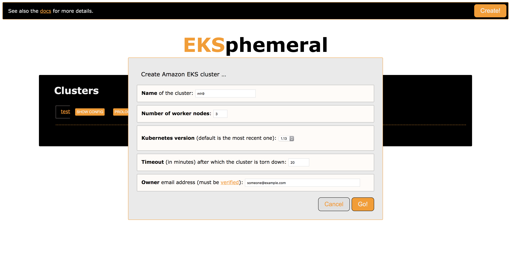
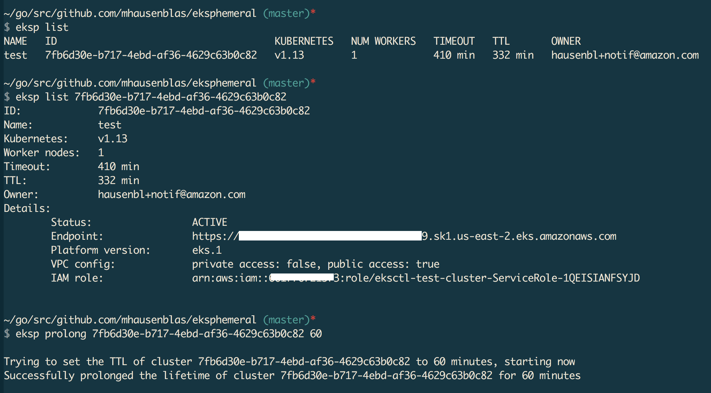

# EKSphemeral: The EKS Ephemeral Cluster Manager

> This is a service for development and test environments.
> Also, note that this is not an official AWS offering but 
> something I cooked up, so use at your own risk.

Managing EKS clusters for dev/test environments manually is boring. 
You have to wait until they're up and available and have to remember 
to tear them down again to minimize costs.

How about automate these steps? Meet EKSphemeral :)

EKSphemeral is a simple Amazon EKS manager for ephemeral dev/test clusters,
 allowing you to launch EKS clusters that auto-tear down after a time period,
 and you can also prolong their lifetime if you want to continue to use them.

You can either use the EKSphemeral UI:



Or the EKSphemeral CLI (both for macOS and Linux):



---

1. [Install](#install)
2. [Use](#use)
   - [Create clusters](#create-clusters)
   - [List clusters](#list-clusters)
   - [Prolong cluster lifetime](#prolong-cluster-lifetime)
3. [Uninstall](#uninstall)
4. [Architecture](#architecture)
5. [Development](#development)

If you like, you can have a look at a [4 min video walkthrough](https://www.youtube.com/watch?v=2A8olhYL9iI), before you try it out yourself.
Since the minimal time for an end-to-end provisioning and usage cycle is ca. 40min, the video walkthrough is showing a 1:10 time compression, roughly.

If you want to try it out yourself, follow the steps below.

## Install

In order to use EKSphemeral all you need is `jq` and the `aws` CLI installed.
The other dependencies, including the [Fargate CLI](https://somanymachines.com/fargate/) 
will be installed automatically, if not present on the system.

Make sure to set the respective environment variables before you proceed. 
This is so that the install process knows where the dependencies are and which S3 bucket to use for the control plane (`EKSPHEMERAL_SVC_BUCKET`) and where to put the cluster metadata (`EKSPHEMERAL_CLUSTERMETA_BUCKET`).

For example:

```sh
$ export EKSPHEMERAL_HOME=~/eksp
$ export EKSPHEMERAL_SVC_BUCKET=eks-svc
$ export EKSPHEMERAL_CLUSTERMETA_BUCKET=eks-cluster-meta
```

Optionally, in order to receive email notifications about cluster creation and destruction,
you need to set the following environment variable, for example:

```sh
$ export EKSPHEMERAL_EMAIL_FROM=hausenbl+eksphemeral@amazon.com
```

In addition to setting the `EKSPHEMERAL_EMAIL_FROM` environment variable, you
MUST [verify](https://docs.aws.amazon.com/ses/latest/DeveloperGuide/verify-email-addresses.html) 
both the source email, that is, the address you provide in `EKSPHEMERAL_EMAIL_FROM` as well as the
target email address (in the `owner` field of the cluster spec, see below for details) in the 
[EU (Ireland)](https://docs.aws.amazon.com/general/latest/gr/rande.html) `eu-west-1` region. 

We're then in the position to install the EKSphemeral CLI and control plane 
(here shown for an install below your home directory):

```sh
$ curl -sL http://get.eksphemeral.info/install.sh | sudo --preserve-env bash
```

Now, let's check if there are already clusters are managed by EKSphemeral:

```sh
$ eksp list
No clusters found
```

Since we just installed EKSphemeral, there are no clusters, yet. Let's change that.

## Use

You can create, inspect, and prolong the lifetime of a cluster with the CLI as shown in the following. If you prefer a visual interface (requires Docker) check out the [local EKSphemeral UI](ui/) proxy.

### Create clusters

Let's create a cluster named `mh9-eksp`, with three worker nodes, 
using Kubernetes version 1.11, with a 15 min timeout as defined in the example 
cluster spec file [mh9-test-other.json](svc/dev/mh9-test-other.json):

```sh
$ cat svc/dev/mh9-test-other.json
{
    "id": "",
    "name": "mh9-eksp",
    "numworkers": 3,
    "kubeversion": "1.11",
    "timeout": 15,
    "ttl": 15,
    "owner": "hausenbl+notif@amazon.com",
    "created": ""
}

$ eksp create svc/dev/mh9-test-other.json
Trying to create a new ephemeral cluster ...
... using cluster spec svc/dev/mh9-test.json
Seems you've set 'us-east-2' as the target region, using this for all following operations
I will now provision the EKS cluster mh9-eksp using AWS Fargate:

[i] Running task eksctl
Waiting for EKS cluster provisioning to complete. Allow some 15 min to complete, checking status every minute:
.........
Successfully created data plane for cluster mh9-eksp using AWS Fargate and now moving on to the control plane in AWS Lambda and S3 ...

Successfully created control plane entry for cluster mh9-eksp via AWS Lambda and Amazon S3 ...

Now moving on to configure kubectl to point to your EKS cluster:
Updated context arn:aws:eks:us-east-2:661776721573:cluster/mh9-eksp in /Users/hausenbl/.kube/config

Your EKS cluster is now set up and configured:
CURRENT   NAME                                                  CLUSTER                                               AUTHINFO                                              NAMESPACE
*         arn:aws:eks:us-east-2:661776721573:cluster/mh9-eksp   arn:aws:eks:us-east-2:661776721573:cluster/mh9-eksp   arn:aws:eks:us-east-2:661776721573:cluster/mh9-eksp

Note that it still can take up to 5 min until the worker nodes are available, check with the following command until you don't see the 'No resources found.' message anymore:
kubectl get nodes
```

Note that if no cluster spec is provided, [default](svc/default-cc.json) will be
used along with first security group of the default VPC.

Once the cluster is ready (and you've verified your email addresses) you should
get a notification that looks something like the following:


The same is true 5 minutes before the cluster shuts down.

### List clusters

Next, let's check what clusters are managed by EKSphemeral:

```sh
$ eksp list
NAME       ID                                     KUBERNETES   NUM WORKERS   TIMEOUT   TTL      OWNER
mh9-eksp   e90379cf-ee0a-49c7-8f82-1660760d6bb5   v1.12        2             45 min    42 min   hausenbl+notif@amazon.com
```

Here, we get an array of cluster IDs back. We can use such a cluster ID as follows to look up the spec of a particular cluster:

```sh
$ eksp list e90379cf-ee0a-49c7-8f82-1660760d6bb5
ID:             e90379cf-ee0a-49c7-8f82-1660760d6bb5
Name:           mh9-eksp
Kubernetes:     v1.12
Worker nodes:   2
Timeout:        45 min
TTL:            38 min
Owner:          hausenbl+notif@amazon.com
Details:
        Status:             ACTIVE
        Endpoint:           https://A377918A0CA6D8BE793FF8BEC88964FE.sk1.us-east-2.eks.amazonaws.com
        Platform version:   eks.2
        VPC config:         private access: false, public access: true
        IAM role:           arn:aws:iam::661776721573:role/eksctl-mh9-eksp-cluster-ServiceRole-1HT8OAOGNNY2Y
```

### Prolong cluster lifetime

When you get a notification that one of your clusters is about to shut down or really at any time before it shuts down, you can prolong the cluster lifetime using the `eksp prolong` command.

Let's say we want to keep the cluster with the ID `e90379cf-ee0a-49c7-8f82-1660760d6bb5` around 
for 13 min longer. Here's what you would do:

```sh
$ eksp prolong e90379cf-ee0a-49c7-8f82-1660760d6bb5 13

Trying to set the TTL of cluster e90379cf-ee0a-49c7-8f82-1660760d6bb5 to 13 minutes, starting now
Successfully prolonged the lifetime of cluster e90379cf-ee0a-49c7-8f82-1660760d6bb5 for 13 minutes.

$ eksp list
NAME       ID                                     KUBERNETES   NUM WORKERS   TIMEOUT   TTL      OWNER
mh9-eksp   e90379cf-ee0a-49c7-8f82-1660760d6bb5   v1.12        2             13 min    13 min   hausenbl+notif@amazon.com
```

Note that the prolong command updates the `timeout` field of your cluster spec, that is, the cluster TTL is counted from the moment you issue the prolong command, taking the remaining cluster runtime into account.

## Uninstall

To uninstall EKSphemeral, use the following command. This will remove the 
control plane elements, that is, delete the Lambda functions and remove all 
cluster specs from the `EKSPHEMERAL_CLUSTERMETA_BUCKET` S3 bucket:

```bash
$ eksp uninstall
Trying to uninstall EKSphemeral ...
Taking down the EKSphemeral control plane, this might take a few minutes ...

aws s3 rm s3://eks-cluster-meta --recursive
aws cloudformation delete-stack --stack-name eksp

Tear-down will complete within some 5 min. You can check the status manually, if you like, using 'make status' in the svc/ directory.
Once you see a message saying something like 'Stack with id eksp does not exist' you know for sure it's gone :)

Thanks for using EKSphemeral and hope to see ya soon ;)
```

Note that the service code bucket and the cluster metadata bucket are still around after this. 
You can either manually delete them or keep them around, to reuse them later. 

## Architecture

EKSphemeral has a control plane implemented in an AWS Lambda/Amazon S3 combo, 
and as its data plane it is using [eksctl](https://eksctl.io) running in AWS 
Fargate. The architecture looks as follows:  


1. With `eksp install` you provisions EKSphemeral's control plane (Lambda+S3).
2. Whenever you want to provision a throwaway EKS cluster, use `eksp create`. It will do two things: 
3. Provision the cluster using `eksctl` running in Fargate, and when that is completed,
4. Create an cluster spec entry in S3, via the `/create` endpoint of EKSphemeral's HTTP API.
5. Every five minutes, a CloudWatch event triggers the execution of another Lambda function called `DestroyClusterFunc`,
   which notifies the owners of clusters that are about to expire (send an email up to 5 minutes before the cluster is destroyed),
   and when the time comes, it tears the cluster down. 
6. Once the EKS cluster is provisioned and the Kubernetes context is configured you can use your cluster.
7. You can use `eksp list` (via the `/status` endpoint) at any time to list managed clusters.
8. If you want to keep your cluster around longer, use `eksp prolong` (via the `/prolong` endpoint) to extend its lifetime.
9. Last but not least, if you want to get rid of EKSphemeral, use the `eksp uninstall`, removing all cluster specs in the S3 bucket and deleting all Lambda functions.

## Development

To manually install the binary CLI, for example on macOS, do:

```sh
$ curl -sL https://github.com/mhausenblas/eksphemeral/releases/download/v0.3.0/eksp-macos -o eksp
$ chmod +x eksp
$ sudo mv ./eksp /usr/local/bin
```

To learn how to customize and extend EKSphemeral or simply toy around with it, 
see the dedicated [development docs](dev.md).