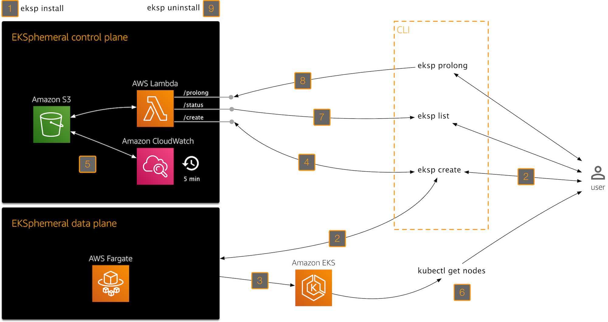

# Architecture

EKSphemeral has a control plane implemented in an AWS Lambda/Amazon S3 combo, 
and as its data plane it is using [eksctl](https://eksctl.io) running in AWS 
Fargate. The architecture looks as follows:  

1. With `eksp install` you provisions EKSphemeral's control plane (Lambda+S3).
2. Whenever you want to provision a throwaway EKS cluster, use `eksp create`. It will do two things: 
3. Provision the cluster using `eksctl` running in Fargate, and when that is completed,
4. Create an cluster spec entry in S3, via the `/create` endpoint of EKSphemeral's HTTP API.
5. Every five minutes, a CloudWatch event triggers the execution of another Lambda function called `DestroyClusterFunc`,
   which notifies the owners of clusters that are about to expire (send an email up to 5 minutes before the cluster is destroyed),
   and when the time comes, it tears the cluster down. 
6. Once the EKS cluster is provisioned and the Kubernetes context is configured you can use your cluster.
7. You can use `eksp list` (via the `/status` endpoint) at any time to list managed clusters.
8. If you want to keep your cluster around longer, use `eksp prolong` (via the `/prolong` endpoint) to extend its lifetime.
9. Last but not least, if you want to get rid of EKSphemeral, use the `eksp uninstall`, removing all cluster specs in the S3 bucket and deleting all Lambda functions.