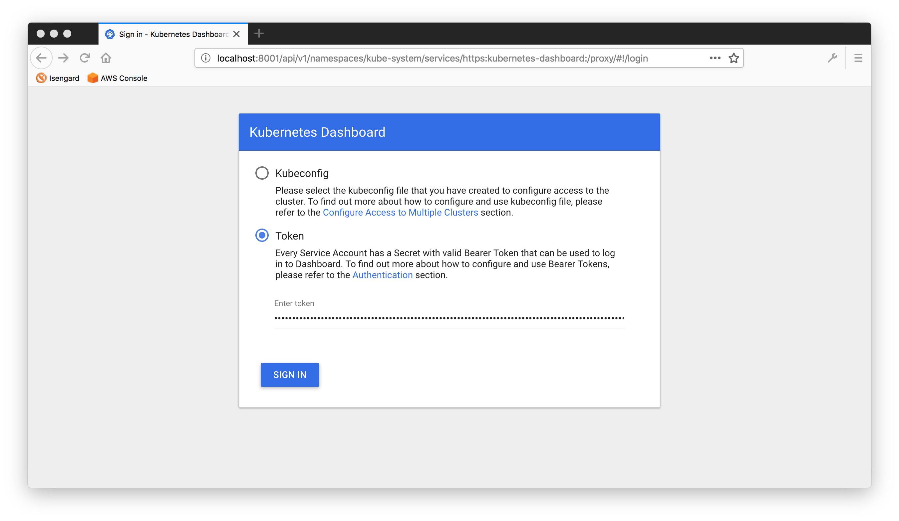
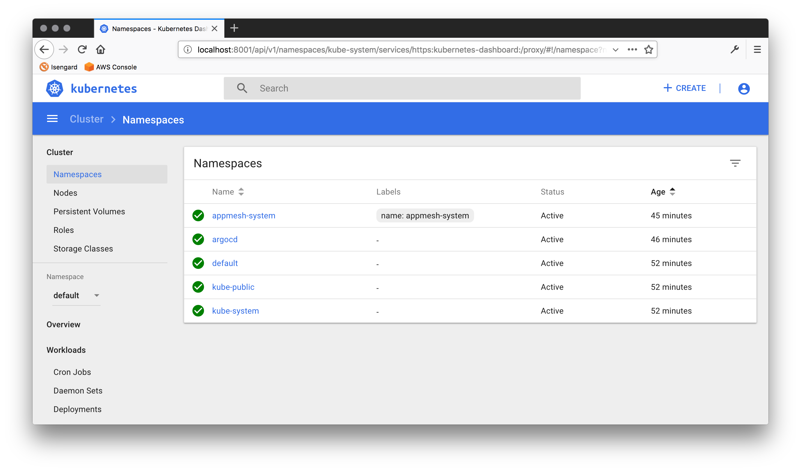
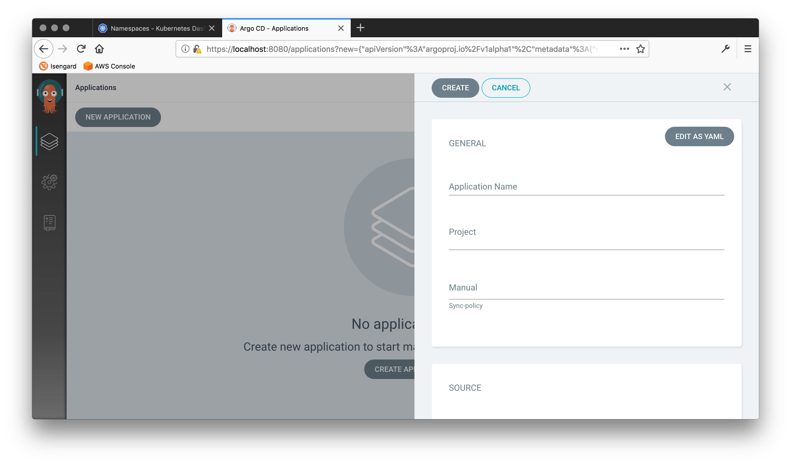

# The EKSphemeral CLI

!!! info
    Currently, the CLI binaries are available for both macOS and Linux platforms.

You can create, inspect, and prolong the lifetime of a cluster with the CLI as 
shown in the following.

## Manual install

!!! note
    You usually don't need to install the CLI manually, it should have been set up with the overall install. However, in cases where you want to access EKSphemeral from a machine other than the one you set it up originally or the CLI has been removed by someone or something, follow the steps here.


To manually install the binary CLI, for example on macOS, do:

```sh
$ curl -sL https://github.com/mhausenblas/eksphemeral/releases/latest/download/eksp-macos -o eksp
$ chmod +x eksp
$ sudo mv ./eksp /usr/local/bin
```

Now, let's check if there are already clusters are managed by EKSphemeral:

```sh
$ eksp list
No clusters found
```

Since we just installed EKSphemeral, there are no clusters, yet. Let's change that.

## Create clusters

The CLI allows you to create ephemeral EKS clusters with a single command, based
on a simple JSON cluster spec file.

### Basics

Let's create a cluster named `mh9-eksp`, with three worker nodes, 
using Kubernetes version 1.12, with a 150 min timeout. 

First, create a file `cluster-spec.json` with the following content:

```json
{
    "id": "",
    "name": "mh9-eksp",
    "numworkers": 3,
    "kubeversion": "1.12",
    "timeout": 150,
    "ttl": 150,
    "owner": "hausenbl+notif@amazon.com",
    "created": ""
}
```

Now you can use the `create` command like so:

```sh
$ eksp create cluster-spec.json
Trying to create a new ephemeral cluster ...
... using cluster spec cluster-spec.json
Seems you have set 'us-east-2' as the target region, using this for all following operations
I will now provision the EKS cluster mh9-eksp using AWS Fargate:

[i] Running task eksctl
Waiting for EKS cluster provisioning to complete. Allow some 15 min to complete, checking status every minute:
.........
Successfully created data plane for cluster mh9-eksp using AWS Fargate and now moving on to the control plane in AWS Lambda and S3 ...

Successfully created control plane entry for cluster mh9-eksp via AWS Lambda and Amazon S3 ...

Now moving on to configure kubectl to point to your EKS cluster:
Updated context arn:aws:eks:us-east-2:661776721573:cluster/mh9-eksp in /Users/hausenbl/.kube/config

Your EKS cluster is now set up and configured:
CURRENT   NAME                                                  CLUSTER                                               AUTHINFO                                              NAMESPACE
*         arn:aws:eks:us-east-2:661776721573:cluster/mh9-eksp   arn:aws:eks:us-east-2:661776721573:cluster/mh9-eksp   arn:aws:eks:us-east-2:661776721573:cluster/mh9-eksp

Note that it still can take up to 5 min until the worker nodes are available, check with the following command until you don't see the 'No resources found.' message anymore:
kubectl get nodes
```

!!! note 
    If no cluster spec is provided, a default cluster spec will be used along with the first security group of the default VPC.

Once the cluster is ready and you've verified your email addresses you should
get a notification that looks something like the following:


The same is true at least five minutes before the cluster shuts down.

!!! tip
    Above implicitly uses the [base](https://github.com/mhausenblas/eksphemeral/blob/master/Dockerfile.base) image.
    If you want a few more things installed, such as the Kubernetes dashboard, ArgoCD, and App Mesh, use the `eksctl:deluxe` image as shown in the following.

### Advanced cluster creation

You can also use the [deluxe](https://github.com/mhausenblas/eksphemeral/blob/master/Dockerfile.deluxe) image,
available via [Quay.io](https://quay.io/repository/mhausenblas/eksctl?tag=latest&tab=tags), 
to create an ephemeral cluster with the Kubernetes Dashboard, [ArgoCD](https://argoproj.github.io/argo-cd/), 
and [AWS App Mesh](https://aws.amazon.com/app-mesh/) (incl. Prometheus and Grafana) pre-installed.

Do the following to provision an ephemeral `deluxe` cluster:

```sh
$ cat /tmp/eks-deluxe.json
{
    "id": "",
    "name": "mh9-deluxe",
    "numworkers": 2,
    "kubeversion": "1.13",
    "timeout": 1440,
    "ttl": 1440,
    "owner": "hausenbl+notif@amazon.com",
    "created": ""
}
```

And then:

```sh
$ EKSPHEMERAL_EKSCTL_IMG=deluxe eksp create /tmp/eks-deluxe.json
...
```

This takes some 15 min and after that, to access the **Kubernetes dashboard** we need to 1. proxy the UI locally, and 2. sort out the access control bits.

First, launch the proxy to forward traffic to you local environment:

```sh
$ kubectl proxy
```

Next, let's sort out the access control bits:

First, create a service account `eks-admin`:

```sh
$ kubectl -n kube-system create sa eks-admin
```
... and give it cluster admin rights ...

```sh
$ kubectl create clusterrolebinding eks-admin \
                 --clusterrole=cluster-admin \
                 --serviceaccount=kube-system:eks-admin
```
... and finally, get the `token` for logging into the dashboard:

```sh
$ kubectl -n kube-system describe secret \
             $(kubectl -n kube-system get secret | grep eks-admin | awk '{print $1}') | grep ^token
token:      e****************************************************************************************************************g
```

Finally, got to the [dashboard](http://localhost:8001/api/v1/namespaces/kube-system/services/https:kubernetes-dashboard:/proxy/#!/login) and use the value of `token` from the last command to log into the dashboard:



Once you've completed the login, select the "Namespace" tab, left-hand side to check if all is as it should be, compare with the following screen shot:




To access the **ArgoCD UI**, do:

```sh
$ kubectl port-forward svc/argocd-server -n argocd 8080:443
```

And now execute:

```sh
$ kubectl get pods -n argocd -l app.kubernetes.io/name=argocd-server -o name | cut -d'/' -f 2
argocd-server-7c7c748648-nlrwq
```

Finally, open [localhost:8080](https://localhost:8080/) and log in with username `admin` and password using the pod name from the previous step, in my case `argocd-server-7c7c748648-nlrwq`:


Once you've completed the login, you are ready to configure your first app deployment, GitOps style:



That's it. Now let's see how we can introspect and manipulate EKSphemeral clusters.

## List clusters

Next, let's check what clusters are managed by EKSphemeral:

```sh
$ eksp list
NAME       ID                                     KUBERNETES   NUM WORKERS   TIMEOUT   TTL      OWNER
mh9-eksp   e90379cf-ee0a-49c7-8f82-1660760d6bb5   v1.12        2             45 min    42 min   hausenbl+notif@amazon.com
```

Here, we get an tabular rendering of the clusters. We can use a cluster ID as 
follows to look up the spec of a particular cluster:

```sh
$ eksp list e90379cf-ee0a-49c7-8f82-1660760d6bb5
ID:             e90379cf-ee0a-49c7-8f82-1660760d6bb5
Name:           mh9-eksp
Kubernetes:     v1.12
Worker nodes:   2
Timeout:        45 min
TTL:            38 min
Owner:          hausenbl+notif@amazon.com
Details:
        Status:             ACTIVE
        Endpoint:           https://A377918A0CA6D8BE793FF8BEC88964FE.sk1.us-east-2.eks.amazonaws.com
        Platform version:   eks.2
        VPC config:         private access: false, public access: true
        IAM role:           arn:aws:iam::661776721573:role/eksctl-mh9-eksp-cluster-ServiceRole-1HT8OAOGNNY2Y
```

## Prolong cluster lifetime

When you get a notification that one of your clusters is about to shut down or 
really at any time before it shuts down, you can prolong the cluster lifetime 
using the `eksp prolong` command.

Let's say we want to keep the cluster with the ID `e90379cf-ee0a-49c7-8f82-1660760d6bb5` around 
for 13 min longer. Here's what you would do:

```sh
$ eksp prolong e90379cf-ee0a-49c7-8f82-1660760d6bb5 13

Trying to set the TTL of cluster e90379cf-ee0a-49c7-8f82-1660760d6bb5 to 13 minutes, starting now
Successfully prolonged the lifetime of cluster e90379cf-ee0a-49c7-8f82-1660760d6bb5 for 13 minutes.
```

Now let's check:

```sh
$ eksp list
NAME       ID                                     KUBERNETES   NUM WORKERS   TIMEOUT   TTL      OWNER
mh9-eksp   e90379cf-ee0a-49c7-8f82-1660760d6bb5   v1.12        2             13 min    13 min   hausenbl+notif@amazon.com
```

!!! note
    The prolong command updates the `timeout` field of your cluster spec, that is,
    the cluster TTL is counted from the moment you issue the prolong command, 
    taking the remaining cluster runtime into account.

## Uninstall

To uninstall EKSphemeral, use the following command. This will remove the 
control plane elements, that is, delete the Lambda functions and remove all 
cluster specs from the `EKSPHEMERAL_CLUSTERMETA_BUCKET` S3 bucket:

```bash
$ eksp uninstall
Trying to uninstall EKSphemeral ...
Taking down the EKSphemeral control plane, this might take a few minutes ...

aws s3 rm s3://eks-cluster-meta --recursive
aws cloudformation delete-stack --stack-name eksp

Tear-down will complete within some 5 min. You can check the status manually, if you like, using 'make status' in the svc/ directory.
Once you see a message saying something like 'Stack with id eksp does not exist' you know for sure it's gone :)

Thanks for using EKSphemeral and hope to see ya soon ;)
```

!!! warning
    The service code bucket and the cluster metadata bucket are still around
    after the `uninstall` command has completed. You can either manually delete 
    them or keep them around, to reuse them later. 

This concludes the CLI walkthrough.