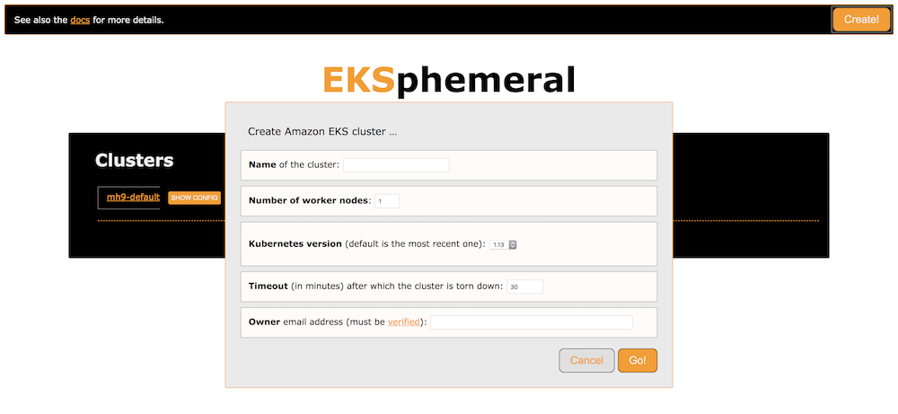
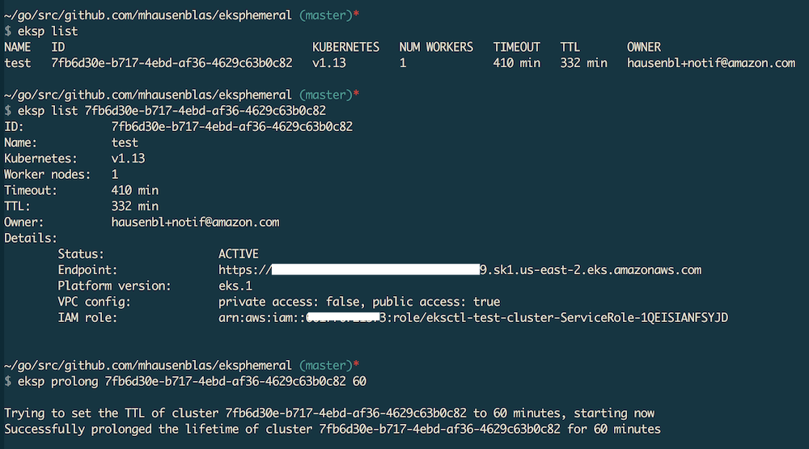

# The EKS Ephemeral Cluster Manager

!!! note 
    This is a service for development and test environments. It is not an official AWS offering, use at your own risk.

Managing Amazon EKS clusters for development and test environments manually is
boring. You have to wait until they're provisioned and then have to remember 
to tear them down again, in order to minimize costs. How about automating these
steps? 

Meet EKSphemeral, the simple manager for ephemeral EKS clusters, allowing you to
launch EKS clusters that auto-tear down after some time, and you can also prolong
their lifetime if you want to continue to use them.

You can either use the [EKSphemeral UI](ui/):



Or the [EKSphemeral CLI](cli/):



## Install

In order to use EKSphemeral you need to have `jq` ([install](https://stedolan.github.io/jq/download/)) and the `aws` CLI ([install](https://docs.aws.amazon.com/cli/latest/userguide/cli-chap-install.html)) installed.
All other dependencies, such as the [Fargate CLI](https://somanymachines.com/fargate/) will be installed automatically, if not present on the system.

!!! warning
    Make sure to set the respective environment variables as shown here before you proceed. Most install issue come from not all environment variables set.

The following environment variables need to be set so that the install process knows where the dependencies are and which 
S3 bucket to use for the control plane (`EKSPHEMERAL_SVC_BUCKET`) and where to
put the cluster metadata (`EKSPHEMERAL_CLUSTERMETA_BUCKET`), for example:

```sh
$ export EKSPHEMERAL_HOME=~/eksp
$ export EKSPHEMERAL_SVC_BUCKET=eks-svc
$ export EKSPHEMERAL_CLUSTERMETA_BUCKET=eks-cluster-meta
```

Optionally, in order to receive email notifications about cluster creation and 
destruction, you need to set the `EKSPHEMERAL_EMAIL_FROM` environment variable, for example:

```sh
$ export EKSPHEMERAL_EMAIL_FROM=hausenbl+eksphemeral@amazon.com
```

!!! note
    In addition to setting the `EKSPHEMERAL_EMAIL_FROM` environment variable, you MUST [verify](https://docs.aws.amazon.com/ses/latest/DeveloperGuide/verify-email-addresses.html) both the source email, that is, the address you provide in `EKSPHEMERAL_EMAIL_FROM` as well as the   target email address (in the `owner` field of the cluster spec, see below for details) in the [EU (Ireland)](https://docs.aws.amazon.com/general/latest/gr/rande.html) `eu-west-1` region. 

We're now in the position to install EKSphemeral with a single command, 
here shown for an install below your home directory:

```sh
$ curl -sL http://get.eksphemeral.info/install.sh | sudo --preserve-env bash
```

This process can take several minutes. After this, EKSphemeral is installed in your AWS environment as well as the CLI is locally available. Learn more about what exactly is created and running as part of the install process by perusing the EKSphemeral [architecture](/arch). 


## Use

You can create, inspect, and prolong the lifetime of a cluster with the [CLI](cli/) or, if you prefer a visual interface check out the [local EKSphemeral UI](ui/) proxy, which requires Docker.
