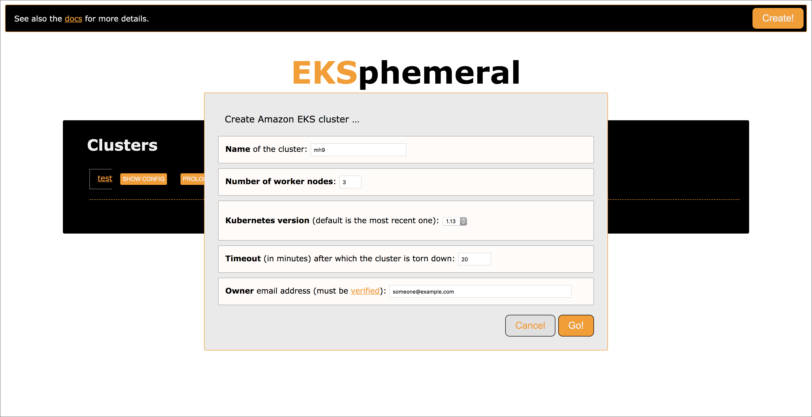
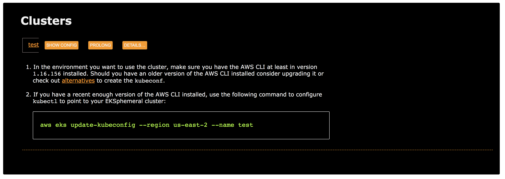
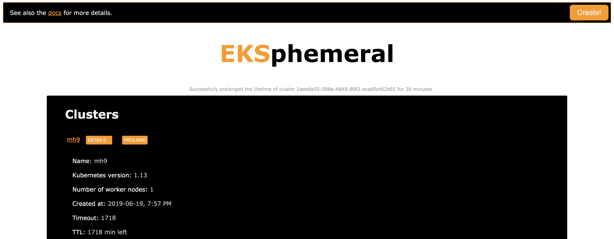

# The EKSphemeral web UI

!!! note

    In order to use the EKSphemeral web UI locally, you need to have Docker installed and running.

To launch the UI, do the following:

```sh
$ ./launch-ui.sh
2019/06/21 10:15:41 EKSPhemeral UI up and running on http://localhost:8080/
^C
```

Optionally, you can tear down the UI proxy manually like so (will be done automatically on launch):

```sh
$ ./stop-ui.sh
docker kill ekspui
ekspui
```

Now, head over to http://localhost:8080 and you should see something like the following.

First, on start up:


When you create a new cluster:



When you want to configure your local environment to use the cluster:



When you want to prolong the life time of a cluster:



