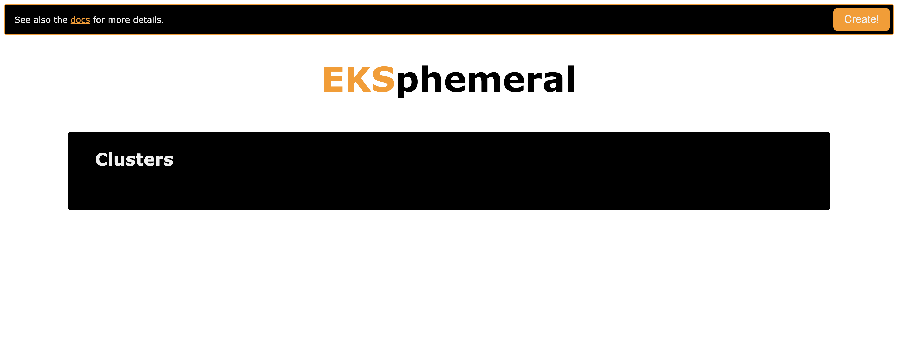

# EKSphemeral Web UI

In order to use the web UI locally, you need to have Docker installed and running.

To launch the UI, do the following:

```sh
$ ./launch-ui.sh
2019/06/21 10:15:41 EKSPhemeral UI up and running on http://localhost:8080/
^C
```

Optionally, you can tear down the UI proxy manually like so (will be done automatically on launch):

```sh
$ ./stop-ui.sh
docker kill ekspui
ekspui
```

Now, head over to http://localhost:8080 and you should see something like the following.

First, on start up:



When you create a new cluster:


When you want to configure your local environment to use the cluster:


When you want to prolong the life time of a cluster:


## Development

If you want to change or extend the UI (HTML, JS, CSS) or the [UI proxy](main.go) you're welcome to do so.
Please make sure you're in the `ui/` directory for the following steps. 

First, export the `EKSPHEMERAL_URL` env variable like so:

```sh
$ export EKSPHEMERAL_URL=$(aws cloudformation describe-stacks --stack-name eksp | jq '.Stacks[].Outputs[] | select(.OutputKey=="EKSphemeralAPIEndpoint").OutputValue' -r)
```

Now you can build the UI container image like so:

```sh
$ make build
GOOS=linux GOARCH=amd64 go build -o ./proxy .
docker build --tag quay.io/mhausenblas/eksp-ui:0.2 .
Sending build context to Docker daemon  10.86MB
Step 1/17 : FROM amazonlinux:2018.03
 ---> a89f4a191d4c
Step 2/17 : LABEL maintainer="Michael Hausenblas <hausenbl@amazon.com>"
 ---> Using cache
 ---> f57e0623e5d8
Step 3/17 : ARG AWS_ACCESS_KEY_ID
 ---> Using cache
 ---> 45fc8c05256c
Step 4/17 : ARG AWS_SECRET_ACCESS_KEY
 ---> Using cache
 ---> 02a4bcc33f74
Step 5/17 : ARG AWS_DEFAULT_REGION
 ---> Using cache
 ---> 6d1562974f7c
Step 6/17 : COPY install.sh .
 ---> Using cache
 ---> 5a6d45d855ce
Step 7/17 : RUN yum install unzip jq git -y && yum clean all &&     curl -sL https://bootstrap.pypa.io/get-pip.py -o get-pip.py &&     python get-pip.py && pip install awscli --upgrade &&     export EKSPHEMERAL_HOME=/eksp &&     chmod +x install.sh && ./install.sh
 ---> Using cache
 ---> dcb28e56940f
Step 8/17 : COPY css/* /app/css/
 ---> Using cache
 ---> f2aad01c40dc
Step 9/17 : COPY img/* /app/img/
 ---> Using cache
 ---> ae2750fca6cd
Step 10/17 : COPY js/* /app/js/
 ---> Using cache
 ---> 82fec12cf16a
Step 11/17 : COPY *.html /app/
 ---> Using cache
 ---> db13d828ff73
Step 12/17 : WORKDIR /app
 ---> Using cache
 ---> 304d80268fbe
Step 13/17 : RUN chown -R 1001:1 /app
 ---> Using cache
 ---> 0c09d65e5358
Step 14/17 : USER 1001
 ---> Using cache
 ---> 6ca8e15efb82
Step 15/17 : COPY proxy .
 ---> Using cache
 ---> 397672a796b3
Step 16/17 : EXPOSE 8080
 ---> Using cache
 ---> 6508d74b4e39
Step 17/17 : CMD ["/app/proxy"]
 ---> Using cache
 ---> 2ad45f31e101
Successfully built 2ad45f31e101
Successfully tagged quay.io/mhausenblas/eksp-ui:0.2
```

Verify that the image has been built and is available, locally:

```sh
$ make verify
REPOSITORY                    TAG                 IMAGE ID            CREATED             SIZE
quay.io/mhausenblas/eksp-ui   0.2                 2ad45f31e101        About an hour ago   449MB
```

Now you can launch it:

```sh
$ make run
docker run      --name ekspui \
                                --rm \
                                --detach \
                                --publish 8080:8080 \
                                --env EKSPHEMERAL_HOME=/eksp \
                                --env AWS_ACCESS_KEY_ID=XXXX \
                                --env AWS_SECRET_ACCESS_KEY=XXXX \
                                --env AWS_DEFAULT_REGION=us-east-2 \
                                --env EKSPHEMERAL_URL=https://nswn7lkjbk.execute-api.us-east-2.amazonaws.com/Prod \
                                quay.io/mhausenblas/eksp-ui:0.2
79a352a4b0259e0b9731d5f3cfb942f185013ac51d14c4d4710eb7cfe1c534b2
```

Keep an eye on the logs of the UI proxy:

```sh
$ docker logs --follow ekspui
2019/06/21 10:06:58 EKSPhemeral UI up and running on http://localhost:8080/
...
```

When you're done, tear down the UI proxy:

```sh
$ make stop
docker kill ekspui
ekspui
```